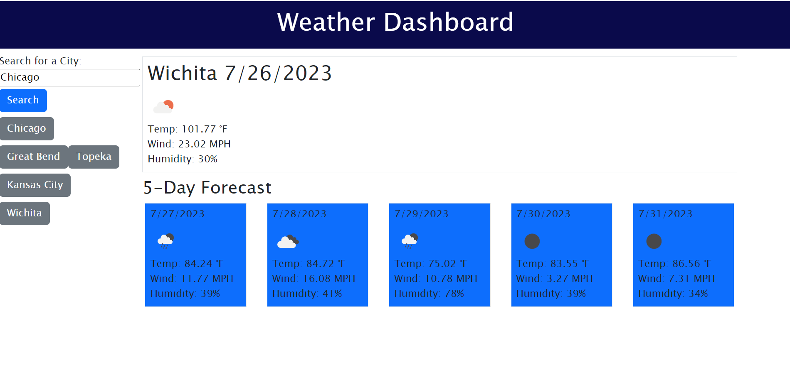

# Weather-App

## Table of Contents
 [Description](#description)

 [Usage](#usage)

 [Credits](#credits)

 [Licenses](#licenses)

 [Questions](#questions)

## Description
 An app that allows the client to search for a city and view the current weather forecast as well as a 5 day forecast.

## Usage
 Type in a city name in the search bar and click the search button. The forecast will then appear with various information including the temperature, humidity, and wind speed.
 
 

## Credits
 This application uses the OpenWeatherMap api to retrieve the forecast data.

## Licenses
 This project is licensed under MIT.

## Questions
 Please direct any questions to:

 GitHub: jdutton8

 Email: jennydutton7@gmail.com